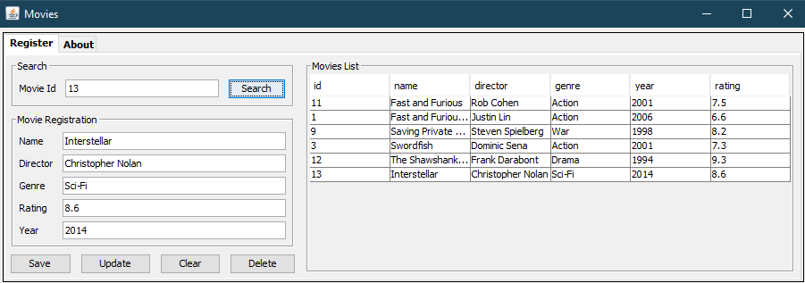

<h1 align="center"> Movie  List Rating</h1>

  <a href="#-technologies">Technologies</a>&nbsp;&nbsp;&nbsp;|&nbsp;&nbsp;&nbsp;
  <a href="#-project">Project</a>&nbsp;&nbsp;&nbsp;|&nbsp;&nbsp;&nbsp;
  <a href="#-layout">Layout</a>&nbsp;&nbsp;&nbsp;|&nbsp;&nbsp;&nbsp;

 

  

## 🚀 Technologies

- Java
- PostgreSQL

## 💻 Project

The project is a software to store and record a list of movies with their respective genres and ratings. The application allows users to add new movies, view the complete list, search by id for each movie. The goal of the project is to provide an intuitive and efficient tool for movie enthusiasts to organize their favorite movie lists.

## 🔖 Layout

The program layout features a simple and organized interface, with text fields for entering information about the movie, such as name, director, genre, year, and rating score. In addition, there are buttons to perform different actions, such as searching for a movie in the list, saving the filled information, clearing all fields, deleting a selected movie, and displaying the complete list with rows and columns containing the text fields for each registered movie. The interface also has an attractive and intuitive design to provide a pleasant and efficient user experience.

---
